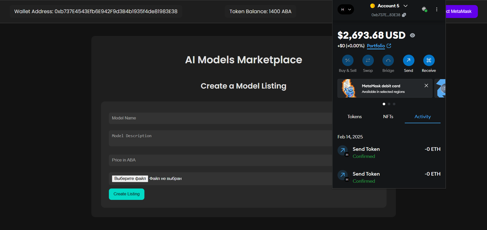
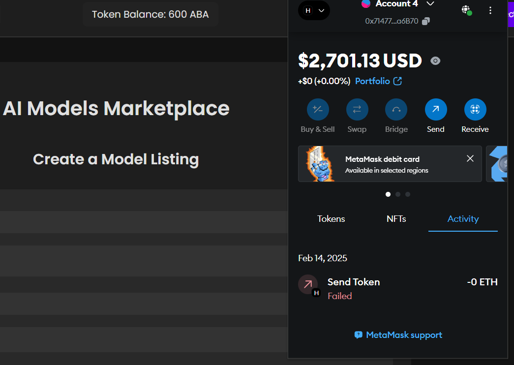
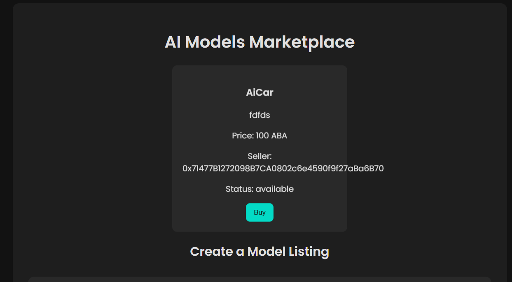
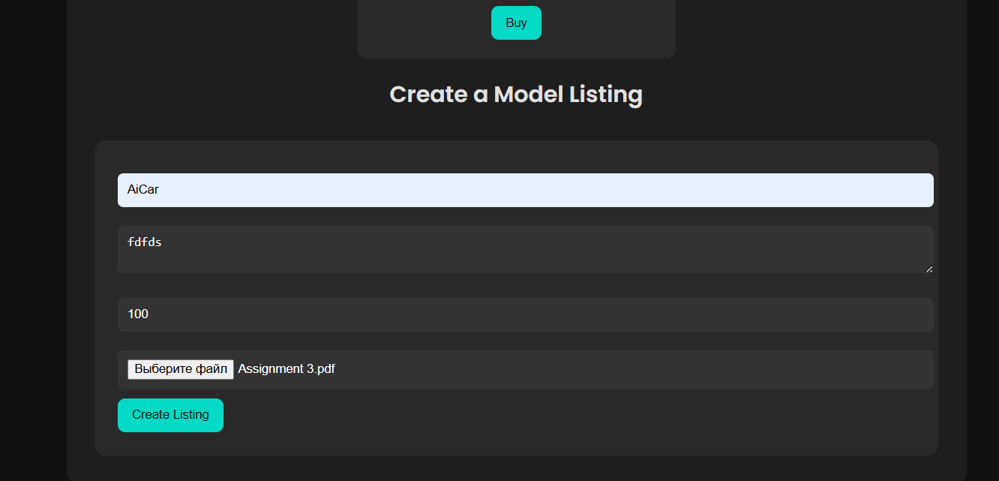
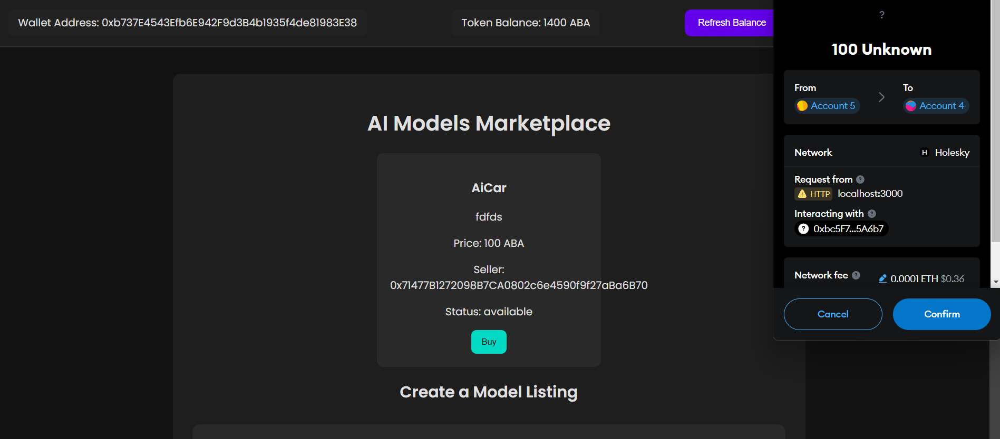
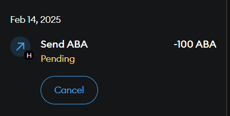
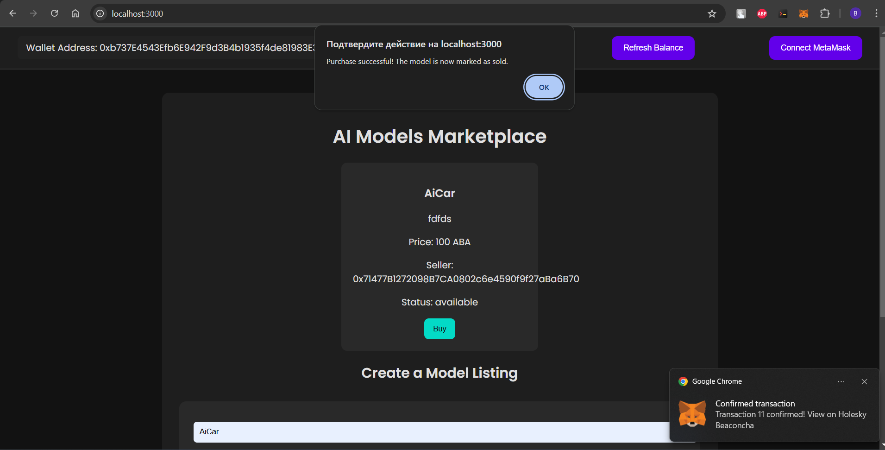

# AI Model Marketplace

## Overview
This project is a decentralized AI Model Marketplace that allows users to buy and sell AI models using an ERC-20 token. The marketplace integrates MetaMask for wallet connection, displays token balances, and facilitates secure transactions between buyers and sellers.

## Features
### 1. User Authentication & Wallet Integration
- Users can connect their MetaMask wallets to interact with the blockchain.
- The connected wallet address is displayed on the interface.

### 2. Token Balance Display
- The user's ERC-20 token balance is displayed on the marketplace.
- Users can refresh their balance with a button click.

### 3. AI Model Listings
- Users can browse AI models for sale.
- Each model includes:
  - Name
  - Description
  - Price in ABA tokens
  - Seller’s wallet address
  - Availability status
- Sellers can create new listings by uploading model details and setting a price.

### 4. Purchase Flow
- Buyers can view AI model details and purchase them using ABA tokens.
- Upon purchase, the specified token amount is transferred to the seller.
- The model status updates to "Sold," preventing further purchases.

## Installation & Setup
### Prerequisites
- Node.js & npm installed
- MetaMask browser extension
- Solidity & Hardhat for smart contract deployment

### Steps
1. Clone the repository:
   ```sh
   git clone https://github.com/your-repo/AI-Model-Marketplace-dApp.git
   cd AI-Model-Marketplace-dApp
   ```
2. Install dependencies:
   ```sh
   npm install
   ```
3. Set up environment variables in `.env`:
   ```sh
   TOKEN_ADDRESS=<your_deployed_token_address>
   TOKEN_ABI=<your_erc20_token_abi>
   ```
4. Start the backend server:
   ```sh
   node server.js
   ```
5. Open `index.html` in a browser to access the marketplace.

## Smart Contract Details
- **Token Contract:** `AITU_ABA_SE2323.sol`
- **Functions:**
  - `listAIModel()` - List a new AI model.
  - `purchaseAIModel()` - Buy an AI model using tokens.
  - `rateModel()` - Rate a purchased model.
  - `transfer()` - Transfer tokens between users.

## Screenshots








## License
This project is licensed under the MIT License. See the LICENSE file for details.

## References
- [MetaMask Integration](https://docs.web3js.org/guides/dapps/metamask-vanilla/)
- [OpenZeppelin ERC-20 Contracts](https://wizard.openzeppelin.com/)

